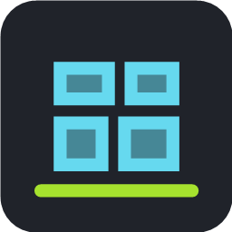

# PowerToys Deck

<div align="center">
  
</div>

<div align="center">
  
  
  
</div>

<p align="center">
  
  
  
  
</p>

<p align="center">
  <a href="https://github.com/sponsors/ChromuSx"></a>
  <a href="https://ko-fi.com/chromus"></a>
  <a href="https://buymeacoffee.com/chromus"></a>
  <a href="https://www.paypal.com/paypalme/giovanniguarino1999"></a>
</p>

<p align="center">
  <strong>PowerToys Deck is a Stream Deck plugin that mirrors your local Microsoft PowerToys setup. Pick PowerToys utilities, global shortcuts, Run aliases, Command Palette commands, and Keyboard Manager mappings from a synchronized Property Inspector.</strong>
</p>

## Stream Deck Plugin

PowerToys Deck reads PowerToys settings from the current Windows user profile and keeps configured Stream Deck keys synchronized when PowerToys shortcuts, enabled modules, Run plugins, Command Palette aliases, or Keyboard Manager mappings change.

The plugin stores a stable command ID per key instead of copying the current shortcut. When PowerToys changes, Stream Deck keys resolve the latest title, icon, hotkey, alias, and execution behavior automatically.

## Features

**PowerToys synchronization**
- Quick Access utilities.
- Global hotkeys from PowerToys modules.
- PowerToys Run plugin action keywords.
- Command Palette aliases and command hotkeys.
- Keyboard Manager key and shortcut mappings.

**Stream Deck experience**
- One configurable `PowerToys Command` action.
- PowerToys-like Property Inspector with search, filters, and command details.
- Automatic title and icon refresh for visible Stream Deck keys.
- Custom key title controls with a `Show title` toggle.
- Missing-command feedback when a PowerToys item is disabled or removed.

**Execution modes**
- Native PowerToys event signaling when available.
- Hotkey fallback for commands without a direct PowerToys event.
- Text injection for PowerToys Run and Command Palette aliases.

## Installation

### From Stream Deck Marketplace

Coming soon.

### Manual Build

Until releases are published, build the plugin locally:

```powershell
cd streamdeck-plugin
npm install
npm run build
npm run package
```

Then double-click:

```text
streamdeck-plugin/com.chromusx.powertoys-deck.streamDeckPlugin
```

## Quick Start

1. Install Microsoft PowerToys and configure the modules you use.
2. Build and install PowerToys Deck.
3. Drag `PowerToys Command` to a Stream Deck key.
4. Choose a command in the Property Inspector.
5. Optionally adjust `Show title` or the custom key title.
6. Press the key to run the synchronized PowerToys action.

## What It Syncs

### Quick Access

Launch supported PowerToys utilities such as Color Picker, FancyZones Editor, PowerToys Run, Command Palette, Text Extractor, Screen Ruler, Shortcut Guide, Workspaces, and more.

### PowerToys Hotkeys

Mirror module hotkeys from PowerToys settings. If a shortcut changes in PowerToys, configured Stream Deck keys use the new shortcut automatically.

### PowerToys Run

Reads enabled PowerToys Run plugins and their action keywords. Pressing a key opens PowerToys Run, clears the query, and types the latest keyword.

### Command Palette

Reads Command Palette hotkeys, aliases, and command hotkeys from local settings. Alias actions open Command Palette and type the latest alias.

### Keyboard Manager

Reads Keyboard Manager key and shortcut mappings from:

```text
%LOCALAPPDATA%\Microsoft\PowerToys\Keyboard Manager\default.json
```

## Requirements

- **Operating System**: Windows 10/11
- **PowerToys**: Installed for the current Windows user
- **Stream Deck Software**: 6.9 or newer
- **Development Runtime**: Node.js 20+
- **Native Helper Build**: .NET SDK 8+

The packaged plugin includes a self-contained native bridge, so users do not need to install the .NET runtime separately.

## Development

### Setup

```powershell
cd streamdeck-plugin
npm install
```

### Build

```powershell
npm run build
```

This publishes the native PowerToys bridge, compiles TypeScript, and copies assets into the `.sdPlugin` build directory.

### Test

```powershell
npm test
```

### Validate

```powershell
npm run validate
```

### Package

```powershell
npm run package
```

### Full Build + Package

```powershell
npm run build:package
```

See [streamdeck-plugin/README.md](streamdeck-plugin/README.md) for plugin-specific development notes.

## How It Works

1. **Catalog scan** - The plugin reads PowerToys JSON settings from `%LOCALAPPDATA%`.
2. **Stable selection** - Each Stream Deck key stores a stable `itemId`.
3. **Live refresh** - File watchers detect PowerToys settings changes and refresh visible keys.
4. **Execution** - Button presses call `PowerToysBridge.exe` to signal PowerToys events, send hotkeys, or type aliases.
5. **Feedback** - The key title, image, and state update to show ready, success, error, or missing states.

## Important Notes

- Stream Deck cannot automatically create new physical keys when PowerToys adds commands. Existing configured keys update automatically.
- The native Stream Deck title field is hidden because the legacy SDK can update rendered titles with `setTitle`, but cannot prefill the native title input.
- PowerToys Deck reads only local PowerToys settings for the current Windows user.
- Commands execute with the same user permissions as Stream Deck.

## Troubleshooting

### No PowerToys commands found

- Make sure PowerToys is installed and has been opened at least once.
- Check that modules are enabled in PowerToys.
- Press the refresh button in the Property Inspector.

### A command is marked missing

- The module may be disabled in PowerToys.
- The alias or mapping may have been removed.
- Reopen the Property Inspector and choose a current command.

### Build errors

```powershell
cd streamdeck-plugin
npm install
dotnet restore native/PowerToysBridge/PowerToysBridge.csproj
npm run build
```

## Contributions

Contributions and improvements are welcome. Useful areas include:

- More PowerToys event mappings.
- Better icon mapping for utilities and aliases.
- Marketplace assets and screenshots.
- Testing across PowerToys versions and Stream Deck devices.

## Support the Project

This project is free and open source. If you find it useful and want to support development, donations help keep the project alive and motivate new features.

<div align="center">
  <a href="https://github.com/sponsors/ChromuSx"></a>
  <a href="https://ko-fi.com/chromus"></a>
  <a href="https://buymeacoffee.com/chromus"></a>
  <a href="https://www.paypal.com/paypalme/giovanniguarino1999"></a>
</div>

## License

This project is licensed under the MIT License. See [LICENSE](LICENSE) for details.

---

<div align="center">
  <sub>Made by <a href="https://github.com/ChromuSx">Giovanni Guarino</a></sub>
</div>
